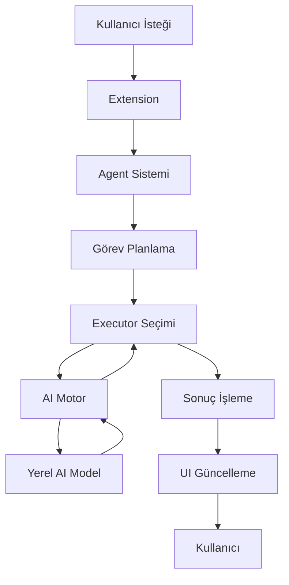

# Smile AI - Detaylı Dokümantasyon

## 📖 İçindekiler

1. [Mimari Genel Bakış](#mimari-genel-bakış)
2. [AI Motor Sistemi](#ai-motor-sistemi)
3. [Agent Sistemi](#agent-sistemi)
4. [Kullanıcı Arayüzleri](#kullanıcı-arayüzleri)
5. [Kod Analiz Sistemi](#kod-analiz-sistemi)
6. [Yapılandırma Seçenekleri](#yapılandırma-seçenekleri)

## 🏗️ Mimari Genel Bakış

### Temel Bileşenler

1. **AI Motor (AI Engine)**
   - Yerel AI modelleriyle iletişim
   - İstek/yanıt yönetimi
   - Bağlam optimizasyonu

2. **Agent Sistemi**
   - Görev planlama
   - Alt görev yönetimi
   - Executor yönetimi

3. **Kod Analiz Sistemi**
   - Statik kod analizi
   - Metrik hesaplama
   - Öneri üretimi

4. **Kullanıcı Arayüzleri**
   - Chat arayüzü
   - Composer arayüzü
   - WebView panelleri

### Veri Akışı



## 🤖 AI Motor Sistemi

### Desteklenen Modeller

#### Ollama
- CodeLlama (varsayılan)
- Llama2
- Mistral
- Diğer uyumlu modeller

#### LM Studio
- Herhangi bir uyumlu model
- API uyumlu modeller

### İstek Formatı

```typescript
interface AIRequest {
    prompt: string;
    systemPrompt?: string;
    maxTokens?: number;
    temperature?: number;
}
```

### Yanıt Formatı

```typescript
interface AIResponse {
    text: string;
    tokens: number;
    finish_reason: string;
}
```

### Bağlam Yönetimi

- Kısa dönem bellek (son N mesaj)
- Uzun dönem bellek (önemli bilgiler)
- Bağlam penceresi optimizasyonu

## 🎯 Agent Sistemi

### Görev Tipleri

1. **Kod Analizi**
   - Kod kalitesi değerlendirme
   - Metrik hesaplama
   - Öneri üretme

2. **Kod Üretimi**
   - Yeni kod oluşturma
   - Şablon uygulama
   - Test üretimi

3. **Kod Düzenleme**
   - Refactoring
   - Optimizasyon
   - Hata düzeltme

4. **Dokümantasyon**
   - Kod açıklama
   - API dokümantasyonu
   - Örnek üretimi

### Executor Sistemi

Her görev tipi için özel executor:
- CodeAnalysisExecutor
- CodeModificationExecutor
- TestGenerationExecutor
- DocumentationExecutor
- RefactoringExecutor
- ExplanationExecutor

## 🖥️ Kullanıcı Arayüzleri

### Chat Arayüzü

Özellikler:
- Markdown desteği
- Kod renklendirme
- Otomatik kaydırma
- Mesaj geçmişi
- Kod kopyalama

Kısayollar:
- `Shift + Enter`: Mesaj gönderme
- `Ctrl + L`: Chat temizleme
- `Ctrl + C`: Kod kopyalama

### Composer Arayüzü

Özellikler:
- Kod üretimi
- Kod düzenleme
- Önizleme
- Diff görünümü
- Bağlam seçenekleri

Bağlam Seçenekleri:
- Import'ları dahil etme
- Tip tanımlarını dahil etme
- Test kodunu dahil etme

## 🔍 Kod Analiz Sistemi

### Analiz Metrikleri

1. **Karmaşıklık**
   - Cyclomatic complexity
   - Cognitive complexity
   - Halstead metrics

2. **Bakım**
   - Maintainability index
   - Technical debt
   - Code smells

3. **Test**
   - Test coverage
   - Test complexity
   - Test maintainability

4. **Dokümantasyon**
   - Documentation coverage
   - API documentation
   - Code comments

### Öneri Sistemi

Öneri Kategorileri:
- Kod kalitesi
- Performans
- Güvenlik
- Bakım
- Test
- Dokümantasyon

Öncelik Seviyeleri:
- Kritik
- Yüksek
- Orta
- Düşük

## ⚙️ Yapılandırma Seçenekleri

### AI Yapılandırması

```json
{
    "smile-ai.aiProvider": {
        "type": "string",
        "enum": ["ollama", "lmstudio"],
        "default": "ollama"
    },
    "smile-ai.modelName": {
        "type": "string",
        "default": "codellama"
    },
    "smile-ai.apiEndpoint": {
        "type": "string",
        "default": "http://localhost:11434"
    },
    "smile-ai.maxTokens": {
        "type": "number",
        "default": 2048
    },
    "smile-ai.temperature": {
        "type": "number",
        "default": 0.7
    }
}
```

### Özellik Yapılandırması

```json
{
    "smile-ai.features": {
        "chat": {
            "maxHistory": 100,
            "autoScroll": true
        },
        "composer": {
            "autoPreview": true,
            "diffView": true
        },
        "analysis": {
            "autoAnalyze": false,
            "showMetrics": true
        }
    }
}
```

### Performans Ayarları

```json
{
    "smile-ai.performance": {
        "cacheSize": 1000,
        "maxConcurrent": 5,
        "timeout": 30000
    }
}
``` 