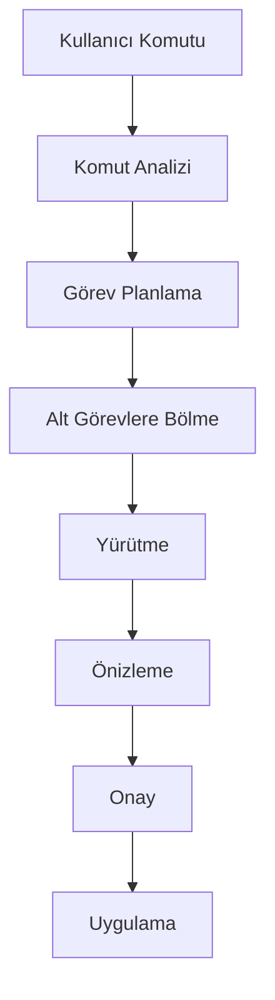

# Smile AI - Teknik Özellikler ve Geliştirme Planı

## 🎯 Temel Hedefler

1. **Yerel AI Bağımsızlığı**
   - İnternet bağlantısı gerektirmeden çalışma
   - Düşük kaynak tüketimi
   - Hızlı yanıt süreleri
   - Gizlilik odaklı yaklaşım

2. **Agent Yetenekleri**
   - Karmaşık görevleri anlama ve planlama
   - Çoklu adımlı işlemleri yönetme
   - Bağlam farkındalığı
   - Proaktif öneriler sunma

3. **Cursor-benzeri Deneyim**
   - Zengin kod düzenleme yetenekleri
   - Gerçek zamanlı önizleme
   - Akıllı kod analizi
   - Sezgisel kullanıcı arayüzü

## 🔄 İş Akışı

### 1. Kullanıcı Etkileşimi

### 2. AI İşlem Süreci

## 🛠️ Teknik Bileşenler

### 1. Extension Core
- VSCode Extension API entegrasyonu
- Olay yönetimi
- Durum yönetimi
- Yapılandırma yönetimi

### 2. AI Engine
- Model yöneticisi
  - Ollama entegrasyonu
  - LM Studio entegrasyonu
  - Model seçimi ve yapılandırması
- Bağlam yöneticisi
  - Kod bağlamı
  - Proje bağlamı
  - Kullanıcı tercihleri
- Bellek yöneticisi
  - Kısa dönem bellek
  - Uzun dönem bellek
  - Bellek optimizasyonu

### 3. Agent System
- Görev planlayıcı
  - Görev analizi
  - Alt görev oluşturma
  - Önceliklendirme
- Yürütme motoru
  - Kod analizi
  - Değişiklik yönetimi
  - Hata kontrolü
- Geri bildirim sistemi
  - Başarı metrikler
  - Hata raporlama
  - Performans izleme

### 4. Editor Integration
- Kod analiz servisi
- Dokümantasyon servisi
- Test servisi
- Refactoring servisi
- Diagnostik servisi

### 5. Kullanıcı Arayüzleri
- **Chat Arayüzü**
  - Oturum yönetimi
  - Mesaj geçmişi
  - Kod önizleme
  - Markdown desteği
  - Kod renklendirme
  - Dosya bağlamı
  - Gerçek zamanlı yanıtlar
  - Responsive tasarım

- **Composer Arayüzü**
  - Kod üretimi
  - Diff görünümü
  - Bağlam seçenekleri
  - Önizleme
  - Kod değişikliği yönetimi
  - Gerçek zamanlı önizleme
  - Responsive tasarım

## 📋 Geliştirme Aşamaları

### Faz 1: Temel Altyapı ✅
- [x] Extension iskeletinin oluşturulması
- [x] Local AI entegrasyonlarının implementasyonu
- [x] Temel komut sisteminin kurulması
- [x] Basit kod analizi ve düzenleme yetenekleri

### Faz 2: Agent Sistemi ✅
- [x] Görev planlama sisteminin geliştirilmesi
- [x] Bağlam yönetim sisteminin implementasyonu
- [x] Alt görev oluşturma ve yönetim sistemi
- [x] Bellek optimizasyon sistemi

### Faz 3: Kullanıcı Arayüzleri 🚀
- [ ] Chat Arayüzü Geliştirme
  - [ ] Oturum yönetimi implementasyonu
  - [ ] Mesaj geçmişi sistemi
  - [ ] Kod önizleme entegrasyonu
  - [ ] Markdown ve kod renklendirme
  - [ ] Responsive tasarım

- [ ] Composer Arayüzü Geliştirme
  - [ ] Kod üretimi arayüzü
  - [ ] Diff görünümü implementasyonu
  - [ ] Bağlam seçenekleri
  - [ ] Önizleme sistemi
  - [ ] Responsive tasarım

### Faz 4: Gelişmiş Bağlam ve Analiz Sistemi 🔍
- [ ] Gelişmiş Bağlam Yönetimi
  - [ ] Proje bağlamı analizi
  - [ ] Dependency graph oluşturma
  - [ ] Sembol referansları indeksleme
  - [ ] Git geçmişi entegrasyonu
  - [ ] Çoklu dosya bağlamı

- [ ] Akıllı Kod Analizi
  - [ ] Kod kalite metrikleri hesaplama
    - [ ] Karmaşıklık analizi
    - [ ] Bakım puanı hesaplama
    - [ ] Kod tekrarı tespiti
  - [ ] Güvenlik açıkları taraması
    - [ ] OWASP kontrolleri
    - [ ] Dependency güvenlik kontrolü
    - [ ] Kod güvenlik analizi
  - [ ] Performans analizi
    - [ ] Darboğaz tespiti
    - [ ] Bellek kullanım analizi
    - [ ] Algoritma karmaşıklığı analizi
  - [ ] Test coverage analizi
    - [ ] Birim test kapsamı
    - [ ] Entegrasyon testi kapsamı
    - [ ] Eksik test senaryoları tespiti

### Faz 5: Proaktif Asistan Sistemi 🤖
- [ ] Proaktif Öneriler
  - [ ] Kod iyileştirme önerileri
    - [ ] Clean code prensipleri
    - [ ] Best practices kontrolleri
    - [ ] Optimizasyon önerileri
  - [ ] Design pattern önerileri
    - [ ] Pattern tespiti
    - [ ] Pattern uygulama önerileri
    - [ ] Anti-pattern uyarıları
  - [ ] Refactoring önerileri
    - [ ] Kod kokusu tespiti
    - [ ] Otomatik refactoring önerileri
    - [ ] Impact analizi
  - [ ] Test senaryoları önerileri
    - [ ] Test case üretimi
    - [ ] Edge case tespiti
    - [ ] Mock/Stub önerileri

### Faz 6: Editör ve Model Entegrasyonları 🔌
- [ ] Gelişmiş Editör Entegrasyonu
  - [ ] Inline code lens
    - [ ] Metrik göstergeleri
    - [ ] Referans sayaçları
    - [ ] Değişiklik geçmişi
  - [ ] Hover bilgileri
    - [ ] Detaylı tip bilgisi
    - [ ] Kullanım örnekleri
    - [ ] Dokümantasyon
  - [ ] Quick fixes
    - [ ] Otomatik düzeltmeler
    - [ ] Kod formatlaması
    - [ ] Import yönetimi
  - [ ] Code actions
    - [ ] Refactoring aksiyonları
    - [ ] Test üretimi
    - [ ] Dokümantasyon üretimi

- [ ] Çoklu Model Desteği
  - [ ] Model yönetim sistemi
    - [ ] Model seçim mantığı
    - [ ] Görev bazlı model ataması
    - [ ] Model performans izleme
  - [ ] Model zincirleme sistemi
    - [ ] Ardışık model çağrıları
    - [ ] Sonuç birleştirme
    - [ ] Hata yönetimi
  - [ ] Fallback mekanizması
    - [ ] Yedek model yapılandırması
    - [ ] Otomatik geçiş mantığı
    - [ ] Hata kurtarma
  - [ ] Performans optimizasyonu
    - [ ] Model önbellekleme
    - [ ] Paralel çalıştırma
    - [ ] Kaynak yönetimi

### Faz 7: Özelleştirme ve Debugging 🛠️
- [ ] Özelleştirilebilir Davranışlar
  - [ ] Kişisel kod stili öğrenme
    - [ ] Stil analizi
    - [ ] Tercih öğrenme
    - [ ] Otomatik uyarlama
  - [ ] Proje özelinde kurallar
    - [ ] Kural tanımlama
    - [ ] Kural doğrulama
    - [ ] Otomatik düzeltme
  - [ ] Özel prompt şablonları
    - [ ] Şablon editörü
    - [ ] Değişken yönetimi
    - [ ] Versiyon kontrolü
  - [ ] Takım standartları
    - [ ] Standart tanımlama
    - [ ] Uyumluluk kontrolü
    - [ ] Raporlama

- [ ] Gelişmiş Debugging Desteği
  - [ ] Hata analizi sistemi
    - [ ] Stack trace analizi
    - [ ] Root cause tespiti
    - [ ] Çözüm önerileri
  - [ ] Runtime analizi
    - [ ] Davranış izleme
    - [ ] State analizi
    - [ ] Flow kontrolü
  - [ ] Log analizi
    - [ ] Log parsing
    - [ ] Pattern tespiti
    - [ ] Anomali tespiti
  - [ ] Performans profiling
    - [ ] CPU profiling
    - [ ] Bellek profiling
    - [ ] Network profiling

### Faz 8: Takım Özellikleri 👥
- [ ] Takım Çalışması Desteği
  - [ ] Kod review asistanı
    - [ ] Otomatik review
    - [ ] Review checklist
    - [ ] Impact analizi
  - [ ] Dokümantasyon yönetimi
    - [ ] Otomatik dok üretimi
    - [ ] Dok güncellemesi
    - [ ] API dok üretimi
  - [ ] Bilgi paylaşım sistemi
    - [ ] Kod bilgi bankası
    - [ ] Best practices rehberi
    - [ ] Örnek kod kataloğu
  - [ ] Standart kontrol sistemi
    - [ ] Kod standartları kontrolü
    - [ ] Kalite metrik takibi
    - [ ] Uyumluluk raporları

## 📅 Önceliklendirme ve Zaman Planı

### Q1 2024
- Faz 4: Gelişmiş Bağlam ve Analiz Sistemi
  - Gelişmiş Bağlam Yönetimi
  - Akıllı Kod Analizi (Temel)

### Q2 2024
- Faz 5: Proaktif Asistan Sistemi
  - Proaktif Öneriler
  - Design Pattern Sistemi

### Q3 2024
- Faz 6: Editör ve Model Entegrasyonları
  - Gelişmiş Editör Entegrasyonu
  - Çoklu Model Desteği (Temel)

### Q4 2024
- Faz 7: Özelleştirme ve Debugging
  - Özelleştirilebilir Davranışlar
  - Debugging Desteği (Temel)

### Q1 2025
- Faz 8: Takım Özellikleri
  - Kod Review Sistemi
  - Dokümantasyon Sistemi

### Q2 2025
- Gelişmiş Özellikler ve Optimizasyonlar
  - Performans İyileştirmeleri
  - Kullanıcı Deneyimi İyileştirmeleri

## 🔍 Teknik Gereksinimler

### Minimum Sistem Gereksinimleri
- VSCode: 1.85.0+
- Node.js: 18.0.0+
- RAM: 8GB+
- Disk: 10GB+ (model boyutlarına bağlı)
- İşlemci: 4+ çekirdek
- GPU: İsteğe bağlı (önerilen)

### Desteklenen AI Modeller
- Ollama
  - CodeLlama
  - Llama2
  - Mistral
- LM Studio
  - Özel modeller
  - Uyumlu açık kaynak modeller

## 📊 Performans Hedefleri

- Yanıt süresi: <500ms (basit işlemler)
- Bellek kullanımı: <500MB (extension)
- CPU kullanımı: <%20 (ortalama)
- Doğruluk oranı: >90% (kod önerileri)

## 🔐 Güvenlik ve Gizlilik

- Tüm işlemler yerel
- Kod verisi dışarı aktarılmaz
- Güvenli model yönetimi
- Yapılandırılabilir izinler
- Şifreleme desteği (gerektiğinde) 